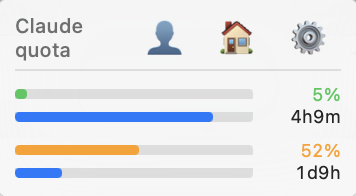

<p align="center">
  
</p>

# Claude Usage Monitor

A macOS menu bar app that displays your Claude AI usage limits at a glance.

<p align="center">
  
</p>

## Features

- Real-time 5-hour and 7-day usage bars
- Countdown timers until limits reset
- Color-coded progress (green → yellow → red)
- Auto-detects your Chrome profile from Claude account
- Shows subscription tier (Max 5x, Max 20x, Pro, Free)
- Quick links to Claude.ai

## Installation

### Homebrew (recommended)

```bash
brew tap Arielbs/claude-usage-monitor https://github.com/Arielbs/claude-usage-monitor
brew install --cask claude-usage-monitor
```

### Manual

Download the `.dmg` from [Releases](https://github.com/Arielbs/claude-usage-monitor/releases) and drag to Applications.

> Requires [Claude Code](https://claude.ai/code) to be installed and logged in.

## Building

```bash
git clone https://github.com/Arielbs/claude-usage-monitor.git
cd claude-usage-monitor
npm install
cargo tauri build
```

## Author

**Ariel J. Ben-Sasson** — [@Arielbs](https://github.com/Arielbs)

Questions or feature requests? [Open an issue](https://github.com/Arielbs/claude-usage-monitor/issues)

## License

[MIT](LICENSE)
